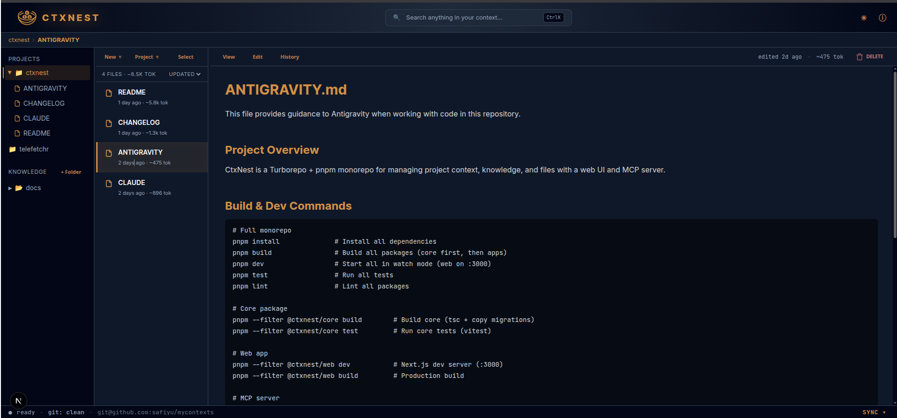

<h1 align="center">
  <br>
  CtxNest v5.0
</h1>
<p align="center"><b>The Centralized Context Engine for Agentic Workflows</b></p>

---

CtxNest is a high-performance markdown context manager that bridges the gap between your local file system and your AI coding assistants. It features a premium "Obsidian-meets-Terminal" UI and a built-in **Model Context Protocol (MCP)** server to provide seamless, versioned knowledge to tools like **Claude Code**, **Gemini**, and **Cursor**.

> [!NOTE]
> **What's new in 5.0** — A much bigger MCP toolbox:
> - **Section-level edits** — agents can now read just one heading's body or surgically replace it, instead of pulling whole files. Big context-window win.
> - **Search excerpts** — every search hit ships with a snippet around the match, so agents skip the "now read the file to see what matched" step.
> - **Folders, batch ops, stats, and journaling** — agents can finally manage structure, create/delete in bulk, get a one-shot overview, and append timestamped journal entries without touching the web UI.
> - **`refresh_index`** — fixes drift when an editor or sync writes a file behind CtxNest's back.
> See [`CHANGELOG.md`](CHANGELOG.md) for details.

<p align="center">
  
</p>

## Why CtxNest?

Git is built for code; CtxNest is built for **context**. It gives you a **single global vault** for context across every project, **two-way sync** that pulls and merges collaborator changes via native git, **versioned snapshots** as a safety net for accidental wipes, and a **pay-as-you-go MCP surface** so agents fetch only what they need instead of preloading thousands of tokens per turn. Registering a project also makes it part of a global pool — agents can pull standards from any project to help with the current one.

> [!TIP]
> Deleting a project file in CtxNest only un-indexes it from the AI's memory. Your physical source code is never touched.

---

## Why Local-First

CtxNest runs entirely on your machine — no cloud account, no remote inference, no telemetry. That isn't a missing feature, it's the design.

- **Privacy & security** — your source, notes, and clipped pages never leave your SSD. Nothing to breach, nothing to "train on", no SOC2 box to tick before you can use it.
- **Zero latency** — disk reads and SQLite FTS5 finish in milliseconds. No upload speeds, no API timeouts, no cold-start round-trips between your editor and a hosted index.
- **Zero infrastructure cost** — no subscriptions, no per-seat pricing, no server to keep alive. Run it on a laptop or a homelab box; it's the same binary either way.
- **Plays nicely with the rest of your stack** — the MCP server is a stdio process your agent already knows how to spawn; the web UI is a localhost service you can put behind a Tailscale/Cloudflare tunnel if you want remote access on your terms.

---

## Key Features

- **Global vault & two-way sync** — single git repo for context across all projects; native pull/merge of remote changes.
- **MCP server** — every file-returning tool reports `est_tokens` and `size_bytes`; `list_files` / `search` / `whats_new` / `project_map` also inline `tags`, eliminating N+1 round-trips.
- **Local-first RAG** — SQLite FTS5 (deterministic, no hallucinated relevance), git-backed versioning, no third-party vector clouds.
- **Web clipping** — Readability-extracted Markdown into the knowledge base, deduped by URL. Detects auth walls (`AUTH_REQUIRED`) and accepts a `headers` param for cookie/token retry.
- **Git intelligence** — every edit versioned; `get_history` + `get_diff` let agents explain *why* a decision was made.
- **Live UX** — animated status bar streams git stages over WebSockets, ambient sync feedback, ZIP export of any folder/project.
- **Dual-brain architecture** — project context separated from your personal knowledge base.

## Team Collaboration

Although CtxNest is local-first, it supports team collaboration through its **Global Git Vault**:

1.  **Distributed Sync**: Every developer runs their own local CtxNest instance.
2.  **Git Relay**: When you save context, CtxNest commits and pushes to your team's private Git repository.
3.  **Automatic Merging**: When teammates click "Sync," CtxNest pulls and merges their changes into your local database and filesystem, just like code.

## AI Agent Capabilities

The MCP server exposes **42 tools** designed for agents that care about context-window economy. Every file-returning response is annotated with `est_tokens` and `size_bytes`; list/search responses also inline `tags` and `match_excerpt` so a single call usually replaces 3-5.

### Reading

| Tool | What it does | Example prompt |
| :--- | :--- | :--- |
| `read_file` | Full file contents + token estimate. | "Read CtxNest file 42." |
| `read_files` | Batch read by id (≤200) — symmetric to `create_files` / `delete_files`. | "Read files 12, 15, and 19 in one call." |
| `read_file_by_path` | Same as `read_file` but looked up by absolute path — bridges from your shell's cwd. | "Read `/Users/me/notes/auth.md` from CtxNest." |
| `read_file_outline` | Heading-only outline (level, text, line, byte range) — survey before pulling. | "What sections does the deployment doc have?" |
| `read_section` | Just one heading's body — the rest of the file stays out of context. | "Read the 'Rotation' section of the auth notes." |
| `read_file_lines` | Line-range slice (1-indexed, clamps out-of-range). Honors stack-trace-style references. | "Read lines 40-60 of the auth note." |
| `describe_file` | Everything ABOUT a file without pulling its content: tags, size, history depth, related files, backlinks. Replaces 3-4 chained calls. | "Tell me about file 31 without loading it." |
| `list_files` | Filter by project / tag / folder / favorite / untagged; results carry tags + tokens inline. | "List untagged KB files." |

### Writing

| Tool | What it does | Example prompt |
| :--- | :--- | :--- |
| `create_file`, `create_files` | Single or batch (≤200) create. | "Save these three migration plans as separate files." |
| `update_file` | Replace whole file content; auto-commits to git. | "Update the API contract note with these changes." |
| `update_file_section` | **Surgical**: replace one heading's body without touching siblings. Same git/FTS path as `update_file`. | "Replace the 'Setup' section of the auth note with this." |
| `delete_file`, `delete_files` | Single or batch (≤500) delete. KB files are unlinked from disk; project-reference files are only un-indexed. | "Delete files 12, 15, and 18." |
| `move_file` | Rename / relocate. Validation refuses cross-project / cross-section moves. | "Rename file 7 to `archive/auth-2024.md`." |
| `journal_append` | Append a timestamped `## HH:MM:SS` entry to today's `knowledge/journal/YYYY-MM-DD.md`; creates on first call. | "Add this thought to today's journal: …" |

### Search

| Tool | What it does | Example prompt |
| :--- | :--- | :--- |
| `search` | FTS5 full-text. Returns `match_excerpt` (16-token window with `<<<…>>>` markers) and `title_highlight` so agents see WHERE the match was without re-reading the file. | "Search for `OAuth` across all CtxNest." |
| `bundle_search` | Search + concatenate matches into one prompt-ready blob (XML or Markdown). Stops at `max_tokens` budget; overflow lands in `skipped[]`. | "Bundle the top 5 deployment notes under 30k tokens." |
| `find_related` | Files sharing tags with a given file, ranked by overlap. Surfaces context the same query wouldn't find. | "Find files related to the auth note." |
| `regex_search` | Cross-file regex when FTS5's tokenizer misses (URLs, code identifiers, hyphenated terms). Scope by project; `max_files` / `max_matches_per_file` bound the cost. | "Find every mention of `oa-data-rmspcockpit-[a-z]+` in the project." |
| `grep_in_file` | Within-file regex with line numbers — different from FTS5; catches what tokenizer-based search can't. | "Find every `fact_*` table reference in file 83." |

### Tagging & favorites

| Tool | What it does | Example prompt |
| :--- | :--- | :--- |
| `add_tags`, `remove_tags`, `list_tags`, `set_favorite` | The basics. | "Tag file 22 with `infra` and `2024-q4`." |
| `suggest_tags` | Proposes tags from your existing corpus by FTS-matching the file's distinctive terms against tagged neighbors. No LLM. | "Suggest tags for file 31." |
| `tag_search_results` | Run a search, then bulk-apply tags to every match. | "Tag every file matching 'kubernetes' with `infra`." |

### Folders & projects

| Tool | What it does | Example prompt |
| :--- | :--- | :--- |
| `list_folders`, `create_folder`, `delete_folder` | Folder CRUD. `delete_folder` refuses project folders (the watcher would re-ingest); KB only. | "Create a `journal` folder under the KB." |
| `register_project`, `list_projects` | Add an external repo as a project; CtxNest indexes its `.md` files. Warns when total tokens exceed `CTXNEST_PROJECT_TOKEN_WARN`. | "Register `~/code/foo` as a project." |
| `project_map` | Single-call indented outline of folders + file titles + tags + ids — typically 5× denser than `list_files`. | "Give me a map of the `acme` project." |
| `stats` | Counts: files, untagged, favorites, top tags, by-project breakdown. Optional total token cost. | "How many untagged files are in the KB?" |

### Versioning & integrity

| Tool | What it does | Example prompt |
| :--- | :--- | :--- |
| `get_history`, `get_diff`, `restore_file` | Per-file git log, unified diff between commits, restore to any commit. | "Diff the auth note between this week and last." |
| `commit_backup` | Sync a project's reference files to its global-vault backup tree (push to remote if configured). | "Back up the `acme` project." |
| `diff_against_disk` | Reports drift between disk content and the FTS index (after external edits / sync merges). Returns `in_sync` / `diverged` / `disk_unreadable` / `no_index_row`. | "Did anything change on disk that I missed?" |
| `refresh_index` | Re-scan the KB (or one project) and reconcile the FTS index — picks up new files, refreshes drifted hashes, prunes vanished rows. The MCP server has no file watcher (the web app does), so this is the explicit fix-up after editor / sync writes. | "Refresh the KB index." |

### Discovery

| Tool | What it does | Example prompt |
| :--- | :--- | :--- |
| `whats_new` | Files created or modified since a checkpoint (`"30m"`, `"7d"`, ISO timestamp). Each entry tagged `created`/`modified`. | "What changed in CtxNest in the last 24h?" |
| `clip_url` | Fetch + Readability-extract a web page into the KB. Detects auth walls (Confluence, SSO, login pages) and returns `AUTH_REQUIRED` with a `login_url` so the agent can retry with `headers: { Cookie: … }`. | "Clip `https://wiki/confluence/…`; if it's gated, ask me for a cookie." |

## Quick Start (Docker)

Requires Docker 24+ with the compose plugin — no Node, pnpm, or git clone needed.

### Option A — Docker Hub (recommended, zero build)

Pull and run the pre-built image from [Docker Hub](https://hub.docker.com/r/safiyu/ctxnest) in a single command:

```bash
curl -fsSL https://raw.githubusercontent.com/safiyu/ctxnest/main/docker-compose.hub.yml \
  | docker compose -f - up -d
```

Or download the compose file first and run it directly:

```bash
curl -fsSL https://raw.githubusercontent.com/safiyu/ctxnest/main/docker-compose.hub.yml \
  -o docker-compose.hub.yml

docker compose -f docker-compose.hub.yml up -d
```

To pin a specific release instead of `latest`:

```bash
# Edit docker-compose.hub.yml and change:
#   image: safiyu/ctxnest:latest
# to:
#   image: safiyu/ctxnest:3.1.0
docker compose -f docker-compose.hub.yml up -d
```

To update to the newest image:

```bash
docker compose -f docker-compose.hub.yml pull
docker compose -f docker-compose.hub.yml up -d
```

### Option B — Build from source

Clone the repo and build the image locally (useful if you want to modify the source):

```bash
git clone <repository-url>
cd ctxnest
docker compose up -d --build
```

To change the WebSocket port, override at build time so the value is baked into the client bundle:

```bash
docker compose build --build-arg WS_PORT=4001
WS_PORT=4001 docker compose up -d
```

---

Access the UI at `http://localhost:3000`. Both compose files publish `3001` for the WebSocket file-watcher channel. Data is persisted in `./ctxnest-data` on the host. The container is wired with a healthcheck against `/api/health` (returns `{"status":"ok"}` once the SQLite handle is open).

To stop and remove:
```bash
docker compose -f docker-compose.hub.yml down   # keeps ./ctxnest-data (Hub)
docker compose down                              # keeps ./ctxnest-data (source build)
docker compose down -v                           # also removes volumes (does NOT delete bind-mounted data dir)
```

## Local Development Setup

### Prerequisites

| Tool | Version | Why |
| :--- | :--- | :--- |
| Node.js | **20.x LTS** | Required by Next 15 + React 19 |
| pnpm | **9.15.0** (pinned via `packageManager`) | Package manager for the workspace |
| git | 2.20+ | Sync engine shells out via `simple-git` at runtime |
| C/C++ toolchain | platform-specific (see below) | `better-sqlite3` builds a native module on install |

**Install pnpm** (matches the repo's pinned version):
```bash
# Option A: corepack (ships with Node)
corepack enable && corepack prepare pnpm@9.15.0 --activate

# Option B: npm
npm install -g pnpm@9.15.0
```

**Install the C/C++ toolchain** (only needed for the `better-sqlite3` build during `pnpm install`):
- **Debian/Ubuntu:** `sudo apt install build-essential python3`
- **Fedora/RHEL:** `sudo dnf install gcc-c++ make python3`
- **macOS:** `xcode-select --install`
- **Windows:** Install Visual Studio Build Tools with the "Desktop development with C++" workload

### Repository Layout

CtxNest is a pnpm + turbo monorepo:

```
ctxnest/
├── apps/
│   ├── web/        # Next.js 15 UI (App Router, React 19, Tailwind)
│   └── mcp/        # MCP stdio server for AI agents
├── packages/
│   └── core/       # SQLite/FTS5, git engine, file watcher (@ctxnest/core)
├── data/           # default runtime data (SQLite + global git vault + backups)
├── docker-compose.yml      # build from source
├── docker-compose.hub.yml  # pull from Docker Hub (no build)
├── Dockerfile
├── pnpm-workspace.yaml
└── turbo.json
```

`apps/web` and `apps/mcp` both depend on `@ctxnest/core` via `workspace:*`. The core package must be built once before either app can resolve its imports — `pnpm build` handles this automatically via turbo's dependency graph.

### Install & First Build

```bash
git clone <repository-url>
cd ctxnest
pnpm install                # installs every workspace package, builds better-sqlite3
pnpm build                  # builds @ctxnest/core first, then apps/web and apps/mcp
```

`pnpm install` may take a few minutes on first run while `better-sqlite3` compiles. If you see a build error here, your toolchain is missing — see Prerequisites.

### Run in Development

```bash
pnpm dev
```

This starts:
- Next.js dev server on `http://localhost:3000` (with Turbopack hot reload)
- WebSocket file-watcher on `127.0.0.1:3001` (auto-started by `instrumentation.ts`)

The default data directory is `<repo>/data`. SQLite + WAL files, the global git vault, and per-project backup snapshots all land there. Override with `CTXNEST_DATA_DIR=/path/to/wherever pnpm dev`.

> [!IMPORTANT]
> If you're modifying `packages/core` while developing, run `pnpm -C packages/core dev` in a second terminal — it's `tsc --watch` and rebuilds `dist/` on every save. Next dev loads core from `packages/core/dist/`, not from source, so changes won't appear without that watch process.

### Verify the Install

With `pnpm dev` running:

1. **UI loads:** open `http://localhost:3000` — the three-pane layout (folder tree / file list / content) renders.
2. **Health endpoint:** `curl http://localhost:3000/api/health` returns `{"status":"ok"}`.
3. **WebSocket connected:** open browser DevTools → Network → WS — a connection to `ws://localhost:3001` is open. Footer status bar shows `● synced …` or `● idle` (not red).

### Run in Production (Standalone, without Docker)

For most users, **Docker is the recommended production path** (see Quick Start above). The compose file already wires the healthcheck, port mapping, and data persistence.

If you need to run standalone (e.g. behind a reverse proxy on a bare-metal host):

```bash
pnpm build

NODE_ENV=production \
CTXNEST_DATA_DIR=/var/lib/ctxnest \
PORT=3000 \
WS_PORT=3001 \
CTXNEST_WS_HOST=127.0.0.1 \
node apps/web/.next/standalone/apps/web/server.js
```

You must also place `apps/web/.next/static/` and `apps/web/public/` adjacent to `server.js` in the standalone tree (the `Dockerfile` shows the exact layout). Reverse-proxy `/` to `:3000` and the WebSocket path to `:3001` if you want network access — leave both on `127.0.0.1` if the proxy is on the same host.

### Tests

```bash
pnpm test                     # runs vitest across the workspace (currently: packages/core only)
pnpm -C packages/core test    # same, scoped to core
```

Tests create temporary git repos under `packages/core/tests/test-data/` and never touch your real repo or your global git config.

### Updating

```bash
git pull
pnpm install                  # in case dependencies changed
pnpm build                    # rebuild core + apps
```

If `packages/core/src/db/migrations/` gained new `.sql` files, they run automatically the next time the app boots and acquires the SQLite handle.

### Troubleshooting

- **`better-sqlite3` fails to build during `pnpm install`** — install the C/C++ toolchain (see Prerequisites), then `rm -rf node_modules && pnpm install`.
- **`Cannot find module '@ctxnest/core'`** when starting the web app — you skipped the build step. Run `pnpm -C packages/core build` (or `pnpm build` from the root) once.
- **`database is locked`** in dev — usually a leftover dev process holding the WAL handle. Stop all `pnpm dev` processes; if it persists, remove `data/ctxnest.db-shm` and `data/ctxnest.db-wal` and restart. The DB is cached on `globalThis` to survive HMR; first launches after a hard kill are the danger zone.
- **WebSocket not connecting** — check that port 3001 is free (`lsof -i :3001` / `netstat -ano | findstr 3001`). The server binds to `127.0.0.1` by default. If your browser is on a different host, set `CTXNEST_WS_HOST=0.0.0.0` AND configure `CTXNEST_WS_ORIGINS` (origin allowlist) and/or `CTXNEST_WS_TOKEN`+`NEXT_PUBLIC_WS_TOKEN` (shared secret) — non-loopback connections are rejected by default to avoid leaking file paths on the LAN. See [Operations](#operations).
- **Sync fails with "Configured global remote URL is not a valid git remote"** — only `https://`, `http://`, `ssh://`, `git://`, and scp-form (`user@host:path`) URLs are accepted. `file://` and credential helpers are rejected by design.
- **MCP server returns "Database not initialized"** — ensure `CTXNEST_DATA_DIR` points to the same directory the web UI uses; the MCP server opens its own SQLite handle and reads from `$CTXNEST_DATA_DIR/ctxnest.db`.
- **Build succeeds but `/` shows a placeholder asking for a tablet** — your viewport is below 768px. CtxNest targets tablet+ on the desktop UI; widen the window or open on a larger screen.

## MCP Integration

The MCP server is a **stdio** transport (`StdioServerTransport`). The host AI tool spawns it as a child process and communicates over stdin/stdout — no network port, no separate process to keep running.

**Path & environment:**

- **Server entry:** `apps/mcp/dist/index.js` (built by `pnpm build`). The package also exposes a `ctxnest-mcp` bin if you `pnpm link` it globally.
- **`CTXNEST_DATA_DIR`** — **always set this explicitly.** It must be the same directory the web UI uses, otherwise the MCP server reads from a different SQLite database. The default fallback is `<cwd>/data`, where "cwd" is wherever your AI client launched the process from — that is rarely what you want.
- **`CTXNEST_DB_PATH`** (optional) — defaults to `$CTXNEST_DATA_DIR/ctxnest.db`.

The web UI and the MCP server can run against the same database simultaneously. SQLite WAL mode handles the concurrent reads, and the MCP server uses the same migration system, so first launch order doesn't matter.

### Claude Code

```bash
claude mcp add ctxnest -s user \
  -e CTXNEST_DATA_DIR=/absolute/path/to/your/data \
  -- node /absolute/path/to/apps/mcp/dist/index.js
```

Note the order: `-s` and `-e` are flags to `claude mcp add` and must appear **before** the `--` separator. Anything after `--` is the command + args that Claude Code will spawn.

### Manual configuration (`mcpServers.json`)
 
For Claude Desktop, Cursor, Continue, Gemini, Antigravity, and other clients that read a JSON config file:
 
```json
{
  "mcpServers": {
    "ctxnest": {
      "command": "node",
      "args": ["/absolute/path/to/apps/mcp/dist/index.js"],
      "env": {
        "CTXNEST_DATA_DIR": "/absolute/path/to/your/data"
      }
    }
  }
}
```
 
Use absolute paths — most clients launch the process from their own working directory.
 
**Configuration Paths:**
- **Antigravity & Gemini**: `~/.gemini/antigravity/mcp_servers.json`
- **Claude Desktop**: `~/Library/Application Support/Claude/claude_desktop_config.json` (macOS) or `%APPDATA%\Claude\claude_desktop_config.json` (Windows)
- **Codex**: `.codex/mcp_servers.json`
- **Cursor**: `Settings -> Features -> MCP`

### Docker-based configuration

If CtxNest is running in Docker, the MCP server lives at `/app/apps/mcp/dist/index.js` inside the container. No `env` block is needed — `CTXNEST_DATA_DIR=/app/data` is already set by the compose file.

#### Same machine (AI client on the same host as the container)

Use `docker exec` to spawn the MCP process directly:

```json
{
  "mcpServers": {
    "ctxnest": {
      "command": "docker",
      "args": ["exec", "-i", "ctxnest", "node", "/app/apps/mcp/dist/index.js"]
    }
  }
}
```

`-i` keeps stdin open (required for the stdio transport). `ctxnest` is the `container_name` from the compose file — change it if you renamed the container.

#### Same machine (AI client on the same host as the container)

Use `docker exec` to spawn the MCP process directly:

```json
{
  "mcpServers": {
    "ctxnest": {
      "command": "docker",
      "args": ["exec", "-i", "ctxnest", "node", "/app/apps/mcp/dist/index.js"]
    }
  }
}
```

`-i` keeps stdin open (required for the stdio transport). `ctxnest` is the `container_name` from the compose file — change it if you renamed the container.

#### Mounting your projects (Required for indexing)

For the Docker-based MCP server to see your local files, you **must** mount your projects directory in `docker-compose.yml`:

```yaml
volumes:
  - ./ctxnest-data:/app/data
  - /home/user/Projects:/home/user/Projects  # Mount your host path to the same container path
```

> [!TIP]
> To ensure the AI client (running on your host) and the MCP server (running in the container) agree on file paths, it is recommended to mount your host path to the **exact same path** inside the container (e.g., `/home/safiyu/Projects:/home/safiyu/Projects`).

### Tool response shape

Every file-returning tool annotates its response with `size_bytes` and `est_tokens` so agents can budget their context window before pulling content. The estimator samples each file's head and uses `bytes/4` for ASCII-heavy content (~10% accurate vs BPE) or `bytes/3` for multi-byte (CJK/emoji). List-style tools also carry a `total_est_tokens` summary.

| Tool | Response shape |
| :--- | :--- |
| `read_file`, `read_file_by_path`, `create_file`, `update_file`, `update_file_section` | `{ ...file, size_bytes, est_tokens }` |
| `list_files` | `{ files: [{ ...file, tags, size_bytes, est_tokens }], total_est_tokens }` |
| `search` | `{ matches: [{ ...file, tags, size_bytes, est_tokens, match_excerpt, title_highlight }], total_est_tokens }` — excerpts wrap hits in `<<<…>>>` markers |
| `whats_new` | `{ since, until, count, total_est_tokens, files: [{ ...file, change: "created"\|"modified", tags, size_bytes, est_tokens }] }` |
| `project_map` | `{ stats: { files, folders, roots, truncated }, est_tokens, outline }` (outline is an indented text string with `[id] Title  #tag1 #tag2` per leaf) |
| `register_project` | `{ project, discovered_files_count, total_est_tokens, discovered_files: [...annotated], warnings? }` (warnings include scan failures and over-budget hints) |
| `bundle_search` | `{ bundle, meta: { query, format, total_est_tokens, included: [{id, path, est_tokens}], skipped: [{..., reason}] } }` |
| `read_file_outline` | `{ file_id, path, title, outline: [{ level, text, line, byteStart, byteEnd }] }` |
| `read_section` | `{ file_id, path, heading, level, line, content, size_bytes, est_tokens }` |
| `read_file_lines` | `{ file_id, path, from, to, total_lines, content, size_bytes, est_tokens }` |
| `read_files` | `{ files: [...annotated], total_est_tokens, error_count, errors: [{ id, error }] }` |
| `describe_file` | `{ id, path, title, project_id, project_name, folder, storage_type, tags, favorite, size_bytes, est_tokens, history_count, related: [{id, shared_tag_count}], backlinks: [{id, title, path}] }` — no `content` |
| `grep_in_file` | `{ file_id, path, pattern, match_count, truncated, matches: [{line, text}] }` |
| `regex_search` | `{ pattern, files_scanned, files_truncated, file_hit_count, total_match_count, hits: [{file_id, path, title, match_count, matches: [{line, text}]}] }` |
| `create_files`, `delete_files` | `{ created\|deleted_count, error_count, created\|deleted: [...], errors: [{ index\|id, error }] }` — per-item failures don't abort the batch |
| `tag_search_results` | `{ matched_count, tagged_count, tags_applied, tagged_ids, errors }` |
| `list_folders` | `{ folders: string[], base_path }` |
| `move_file` | `{ ...file }` (post-move record) |
| `stats` | `{ scope, file_count, untagged_count, favorite_count, top_tags: [{name, count}], by_project?, total_est_tokens? }` |
| `suggest_tags` | `{ file_id, path, existing_tags: string[], suggestions: [{ tag, score, sources }] }` |
| `diff_against_disk` | `{ status: "in_sync" \| "diverged" \| "disk_unreadable" \| "no_index_row", ...sizes, first_diff_line?, disk_sample?, index_sample? }` |
| `refresh_index` | `{ scope, newly_indexed, refreshed, pruned }` |
| `journal_append` | `{ file_id, path, date, time, appended_chars, est_tokens }` |
| `clip_url` (auth-walled) | `isError: true` with `{ code: "AUTH_REQUIRED", auth_required: true, login_url, signal, www_authenticate?, hint }` — retry with `headers: {"Cookie": "..."}` or `{"Authorization": "Bearer ..."}` |

> [!NOTE]
> `list_files` and `search` previously returned bare arrays. Clients that pre-parsed the array directly need to read `.files` / `.matches` instead.

**`bundle_search`** runs a full-text search and returns the matched files concatenated into a single prompt-ready blob — saves an agent the round-trips of `search` + N × `read_file` when it needs several related files for context. Inputs mirror `search` (`query`, `project_id`, `tags`, `favorite`) plus `format` (`"xml"` for Anthropic-recommended `<document>` tags, `"markdown"` for `##` headers + fenced blocks; default `"xml"`) and `max_tokens` (budget cap, default 50000). Files are added in rank order and the bundle stops at the first file that would exceed the budget; remaining hits land in `meta.skipped[]` with their estimated size so the agent can decide whether to re-call with a larger budget.

## Configuration

You can customize CtxNest behavior using the following environment variables:

| Variable | Description | Default |
| :--- | :--- | :--- |
| `CTXNEST_DATA_DIR` | Primary storage for Knowledge Base and Backups | `<repo>/data` (web), `/app/data` (Docker) |
| `CTXNEST_DB_PATH` | Path to the SQLite database | `$CTXNEST_DATA_DIR/ctxnest.db` |
| `PORT` | Web UI Port | `3000` |
| `WS_PORT` | WebSocket Port (server-side bind) | `3001` |
| `NEXT_PUBLIC_WS_PORT` | WebSocket Port baked into the client bundle (set at build time) | `3001` |
| `CTXNEST_WS_HOST` | Host the WebSocket server binds to | `127.0.0.1` (`0.0.0.0` in Docker) |
| `CTXNEST_WS_ORIGINS` | Comma-separated allowed `Origin` headers for browser WS clients (only enforced when bound non-loopback) | unset (loopback only) |
| `CTXNEST_WS_TOKEN` | Shared-secret token required as `?token=…` on the WS handshake (only enforced when bound non-loopback) | unset |
| `NEXT_PUBLIC_WS_TOKEN` | Same token, baked into the client bundle at build time so the browser can supply it | unset |
| `CTXNEST_PROJECT_TOKEN_WARN` | Soft cap (in estimated tokens) above which `register_project` and `project_map` add a `warning` to their response. Set to `0` to disable. | `100000` |

The WebSocket server defaults to loopback because file paths flowing over it leak the local filesystem layout. When `CTXNEST_WS_HOST` is set to anything non-loopback (e.g. `0.0.0.0` in Docker), the server **rejects every connection by default** until you configure either `CTXNEST_WS_ORIGINS` (Origin allowlist for browsers) and/or `CTXNEST_WS_TOKEN` (shared secret, also requires `NEXT_PUBLIC_WS_TOKEN` build arg). The shipped `docker-compose.yml` wires `CTXNEST_WS_ORIGINS=http://localhost:3000,http://127.0.0.1:3000` so the browser on the host machine works out of the box without exposing file paths to the LAN.

### Operations

- **Health check:** `GET /api/health` → `200 {"status":"ok"}` when SQLite responds, `503` otherwise.
- **Global git remote:** only `https://`, `http://`, `ssh://`, `git://`, and scp-form (`user@host:path`) URLs are accepted. `file://` and other helpers are rejected.
- **WebSocket auth:** loopback bind = no auth (trusted local). Non-loopback bind requires `CTXNEST_WS_ORIGINS` and/or `CTXNEST_WS_TOKEN` (see Configuration). Without either, all connections are dropped with a `1008` close code and a startup warning is logged.
- **Token estimation:** the file list and content header show `~Nk tok` per file plus per-folder totals. The heuristic samples each file's first 4 KB and switches between `bytes/4` (ASCII-heavy: ~10% accurate) and `bytes/3` (multi-byte: CJK/emoji, more conservative). MCP tool responses include the same `est_tokens` field plus a `total_est_tokens` for list-style tools so agents can budget their context window before pulling content.
- **Minimum viewport:** the UI targets ≥768px. Below that, a placeholder is shown.

---

Built with care for the future of agentic coding.
License: Apache-2.0
