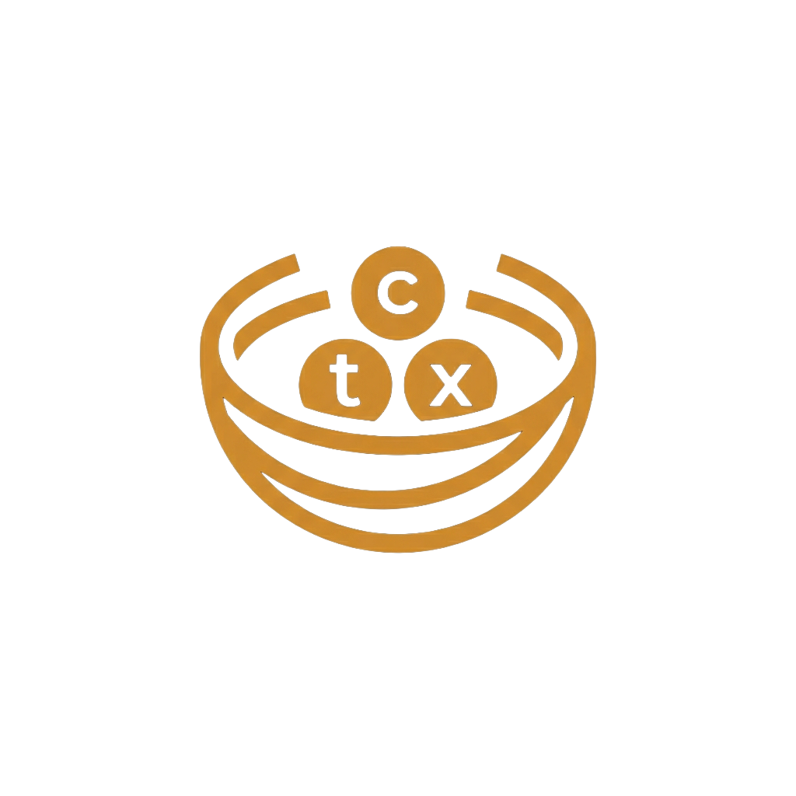

<p align="center">
  
</p>

<h1 align="center">CtxNest v1.1</h1>

<p align="center">The Portable Intelligence Layer for Your Projects & Knowledge Base</p>

---

CtxNest is a high-performance markdown context manager that bridges the gap between your local file system and your AI coding assistants. It features a premium "Obsidian-meets-Terminal" UI and a built-in **Model Context Protocol (MCP)** server to provide seamless, versioned knowledge to tools like **Claude Code**, **Gemini**, and **Cursor**.

## 🧠 Why CtxNest?

Standard Git is built for code, but CtxNest is built for **Context**. While your context files live inside your project repo, CtxNest manages them with a dedicated synchronization layer that offers three critical advantages:

1.  **The Global Vault**: Transition from a fragmented multi-repo setup to a powerful **Single Vault Architecture**. Sync all your projects to a single, unified Git repository, securely organized by project subdirectories.
2.  **True Two-Way Collaboration**: It's not just a backup tool. CtxNest features a sophisticated two-way sync engine that natively pulls and merges changes made by collaborators, gracefully injecting remote additions directly into your local database and workspace using Git's native merge logic.
3.  **Safety & Redundancy**: CtxNest creates independent, versioned snapshots of your context. If you accidentally wipe a folder or face a catastrophic merge conflict in your project, your "Context Git" provides a reliable safety net to restore your AI's memory.

> [!TIP]
> **Total Control**: Deleting a project file in CtxNest only "un-indexes" it from the AI's memory. Your physical source code is never touched, ensuring zero risk to your project repo.

---

## 🚀 Key Features

- **"Sync All" Architecture**: One-click global synchronization across all your registered projects.
- **Git Wizard Integration**: A seamless Git authentication flow supporting SSH, HTTPS (PAT), and CLI auth paths.

- **Native MCP Integration**: Plug-and-play support for all modern AI coding tools.
- **Dual-Brain Architecture**: Segregate project-specific context from your personal Knowledge Base.
- **Obsidian-Chic Aesthetics**: High-contrast amber/rust identity (#D4903A) optimized for deep focus.
- **Smart Pruning**: An intelligent directory tree that hides empty system folders and focuses only on where your context lives.
- **Time Travel**: Built-in Git versioning for every single edit, even in your personal Knowledge Base.

## 🐳 Quick Start (Docker)

The fastest way to deploy CtxNest is using Docker Compose:

```bash
git clone <repository-url>
cd ctxnest
docker compose up -d --build
```
Access the UI at `http://localhost:3000`. Data is persisted in `./ctxnest-data`.

## 🛠 Installation (Local)

```bash
pnpm install
pnpm build
pnpm dev
```

## 🤖 MCP Integration

To connect CtxNest to your AI tool, point it to the built server:

- **Server Path**: `apps/mcp/dist/index.js`
- **Environment**: 
  - `CTXNEST_DATA_DIR`: Path to your data directory (e.g., `~/.ctxnest`).
  - `CTXNEST_DB_PATH`: Path to your `ctxnest.db` (optional, defaults to `CTXNEST_DATA_DIR/ctxnest.db`).

Example for **Claude Code**:
```bash
claude mcp add ctxnest -s user -- node /path/to/apps/mcp/dist/index.js -e CTXNEST_DATA_DIR=/path/to/data
```

Manual configuration (**mcpServers.json**):
```json
{
  "mcpServers": {
    "ctxnest": {
      "command": "node",
      "args": ["/absolute/path/to/apps/mcp/dist/index.js"],
      "env": {
        "CTXNEST_DATA_DIR": "/absolute/path/to/your/data"
      }
    }
  }
}
```

Docker-based configuration (**mcpServers.json**):
If you are running CtxNest in Docker, use `docker exec` to connect:
```json
{
  "mcpServers": {
    "ctxnest": {
      "command": "docker",
      "args": ["exec", "-i", "ctxnest", "node", "/app/apps/mcp/dist/index.js"]
    }
  }
}
```

## 🤖 AI Agent Capabilities

CtxNest transforms your AI assistant from a simple chatbot into a high-context collaborator:

1.  **Dynamic Context**: Query precise documentation without token bloat. 
    *   *Prompt: "Find auth system notes in CtxNest."*
2.  **Two-Way Sync**: Agents write research and plans directly to your version-controlled vault.
    *   *Prompt: "Save this technical migration plan to CtxNest."*
3.  **Time-Travel**: Analyze documentation evolution via built-in Git history.
    *   *Prompt: "Compare today's architecture notes with last week's version."*
4.  **Auto-Indexing**: Agents keep their knowledge map updated automatically as you add files.
    *   *Prompt: "Discover and index any new markdown files in the docs/ folder."*
5.  **Global Patterns**: Apply your personal "Global Vault" standards to any local project.
    *   *Prompt: "Use the coding standards from my personal Knowledge Base for this fix."*
6.  **Live Awareness**: Agents instantly "see" your local documentation edits via the file watcher.
    *   *Prompt: "I just updated the API schema on disk, please re-scan the context."*

## ⚙️ Configuration

You can customize CtxNest behavior using the following environment variables:

| Variable | Description | Default |
| :--- | :--- | :--- |
| `CTXNEST_DATA_DIR` | Primary storage for Knowledge Base and Backups | `~/.ctxnest` |
| `CTXNEST_DB_PATH` | Path to the SQLite database | `DATA_DIR/ctxnest.db` |
| `PORT` | Web UI Port | `3000` |
| `WS_PORT` | WebSocket Port for real-time updates | `3001` |

---

Built with care for the future of agentic coding.
License: Apache-2.0
